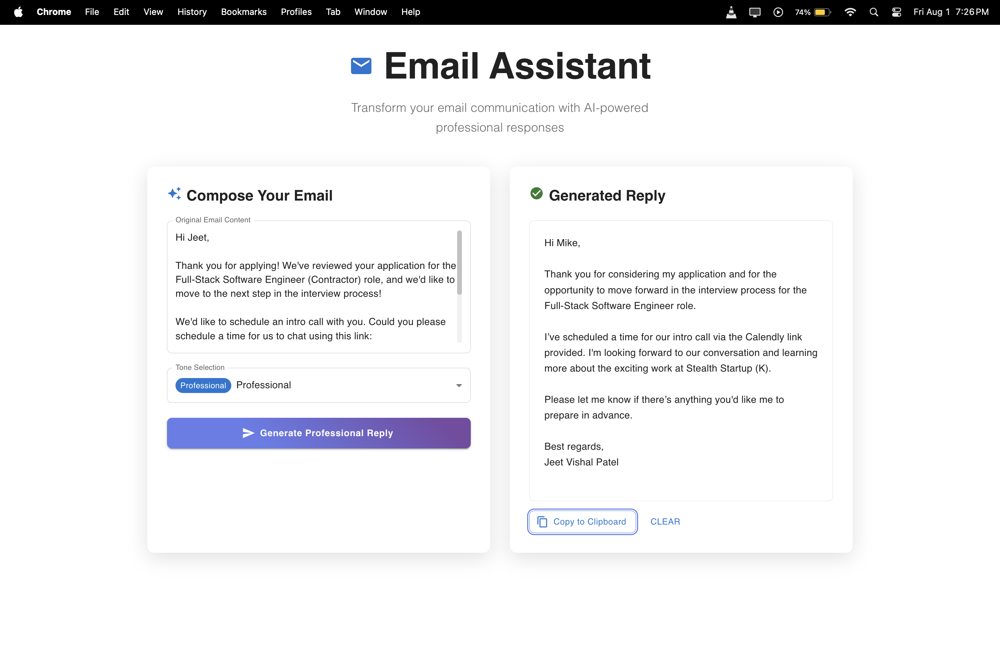
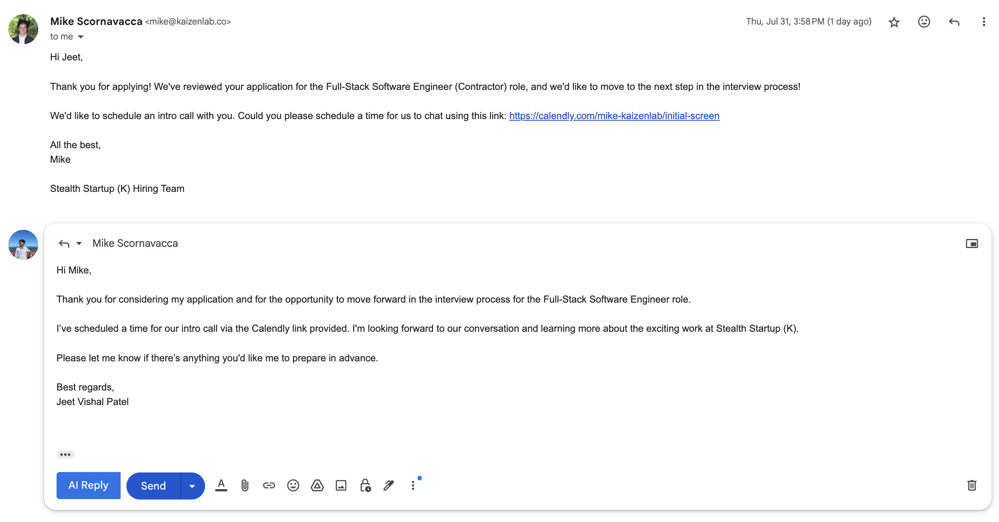

# 📧 Email Assistant

A modern, AI-powered email response generator built with React and Material-UI. Transform your email communication with professional, context-aware responses.

[](https://drive.google.com/file/d/1I0Ue6UV62ncC1YTiLU0RSJuxNLsxPbDG/view?usp=drive_link)


## ✨ Features

- 🤖 **AI-Powered Responses** - Generate professional email replies using advanced AI
- 🎨 **Professional UI** - Clean, modern interface built with Material-UI
- 🎭 **Tone Selection** - Choose from Professional, Friendly, Casual, or Formal tones
- 📋 **One-Click Copy** - Copy generated responses to clipboard instantly
- 📱 **Responsive Design** - Works perfectly on desktop, tablet, and mobile
- ⚡ **Fast & Lightweight** - Built with Vite for optimal performance
- 🔄 **Real-time Generation** - Instant response generation with loading states

## 🚀 Live Demo

[Add your live demo link here]

## 🛠️ Tech Stack

- **Frontend Framework**: React 19.1.0
- **UI Library**: Material-UI (MUI) 7.2.0
- **Build Tool**: Vite 7.0.4
- **HTTP Client**: Axios 1.11.0
- **Icons**: Material-UI Icons
- **Styling**: Emotion (CSS-in-JS)

## 📋 Prerequisites

- **Node.js** (version 16 or higher)
- **npm** or **yarn** package manager
- **Backend API** running on `http://localhost:8080`
- **Gemini API Key** from [Google AI Studio](https://makersuite.google.com/app/apikey)

## 🚀 Quick Start

1. **Clone & Install**
   ```bash
   git clone https://github.com/yourusername/email-assistant.git
   cd email-assistant/frontend/email-assistant
   npm install
   ```

2. **Setup Environment**
   ```bash
   # Frontend
   echo "VITE_API_URL=http://localhost:8080" > .env
   
   # Backend (in backend directory)
   echo "GEMINI_API_KEY=your_api_key_here" > .env
   ```

3. **Start Development**
   ```bash
   npm run dev
   ```
   Open `http://localhost:5173`

## 🔧 Scripts

- `npm run dev` - Start development server
- `npm run build` - Build for production
- `npm run preview` - Preview production build
- `npm run lint` - Run ESLint

## 📖 Usage

1. **Paste Email Content** in the input field
2. **Select Tone** (Optional): Professional, Friendly, Casual, or Formal
3. **Generate Reply** - Click "Generate Professional Reply"
4. **Copy Response** - Use "Copy to Clipboard" button
5. **Clear & Repeat** - Generate new responses as needed

## 🏗️ Project Structure

```
email-assistant/
├── src/
│   ├── App.css          # Professional styling
│   ├── App.jsx          # Main application component
│   ├── index.css        # Global styles
│   └── main.jsx         # Application entry point
├── package.json
├── vite.config.js
└── README.md
```


## 🔑 Gemini API Setup

This project uses Google's Gemini AI for generating email responses. You'll need to set up your Gemini API key:

### 1. Get Gemini API Key
1. Visit [Google AI Studio](https://makersuite.google.com/app/apikey)
2. Sign in with your Google account
3. Click "Create API Key"
4. Copy your API key

### 2. Configure Environment Variables
Create a `.env` file in your backend directory:
```env
GEMINI_API_KEY=your_gemini_api_key_here
```

### 💼 Home Page UI  
A clean and intuitive interface for generating AI-powered email responses.  


### 🧩 Chrome Extension View  
Seamlessly integrate the assistant into your email workflow with the Chrome Extension.  



